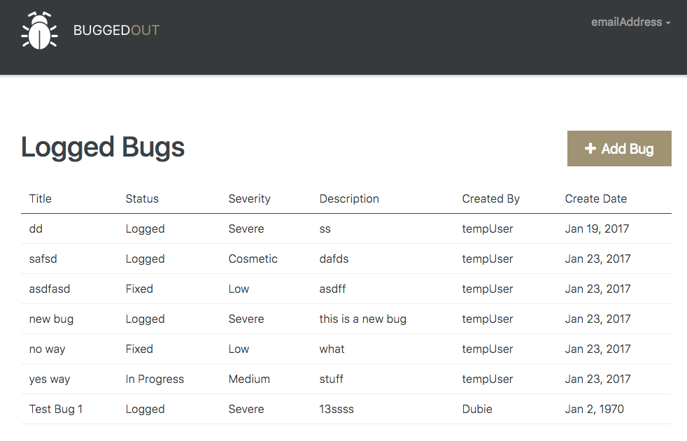

#Dubie's Bug Tracker
In this project I created a basic bug tracker with FireBase as the backend.
It displays a list of the current bugs.
Allows the user to add new bugs or update existing bugs.
The list of bugs is only made when the FireBase database is changed.
This is done via observables to keep the client's data current regardless of the sorce of the change.

#Project Goal
Basic bug tracker that allows adding and updating of bugs.
Subscriptions to the FireBase database allowing for real time updates.

##Project Challange
- FrontEnd Delete option
- Delete from FireBase
- Lisner for delete to update FrontEnd

##Custom Tweeks
- Delete fully implemented
- Clone method added to Bug object
- Editing or Adding now both call configure form instead of sepreate methods.
- ConfigureForm now populates form baised on input.

##Project Dependencies

###NPM Libraries
- Font Awesome
- Bootstrap

###Custom Pipes
- { SeverityPipe } from './pipe/severity.pipe'
- { StatusPipe } from './pipe/status.pipe'

###Custom Validators
{ forbiddenStringValidator } from '../../shared/validation/forbidden-string.validator'
